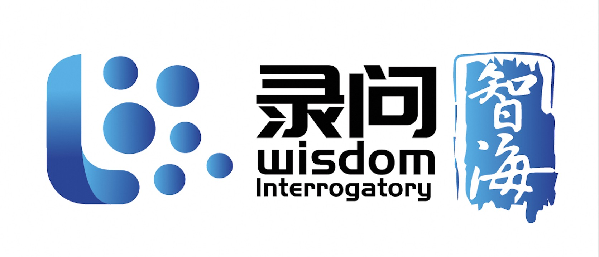








Hello! I am an Assistant Professor (ZJU-100 Young Professor, Doctoral Supervisor) at Zhejiang University. I received my Ph.D. from Zhejiang University under the supervision of Prof. [Kun Kuang](https://kunkuang.github.io/) and Prof. [Fei Wu](https://mypage.zju.edu.cn/wufei). I also earned my B.S. degree from Zhejiang University. 

I actively collaborate with Prof. [Xiaozhong Liu](https://www.wpi.edu/people/faculty/xliu14) from Worcester Polytechnic Institute and Prof. [Adam Jatowt](https://adammo12.github.io/aj/) from the University of Innsbruck.

My research interests encompass LegalAI, Large Language Models, Natural Language Processing, and Causal Inference. I have published over 20 papers in prestigious conferences and journals such as ACL, EMNLP, NAACL, SIGIR, AAAI, KDD, and WWW.

I am the lead contributor to the open-source legal LLM project [wisdomInterrogatory](https://github.com/zhihaiLLM/wisdomInterrogatory), which earned me an invitation to participate in the [Yunqi Conference](https://yunqi.aliyun.com/).

❗️We are currently seeking graduate students. If you are interested in applying or collaborating with me, please feel free to [contact me](mailto:wuyiquan@zju.edu.cn).

# 🔥 News
- *2025.08*: &nbsp;🎉🎉 **Two** papers are accepted by EMNLP'25! 
- *2025.07*: &nbsp;🎉🎉 **One** paper is accepted by Computer Law & Security Review! 
- *2025.05*: &nbsp;🎉🎉 **Two** papers are accepted by ACL'25!
- *2025.04*: &nbsp;🎉🎉 **One** papers are accepted by Artificial Intelligence and Law! 
- *2025.04*: &nbsp;🎉🎉 **Two** papers are accepted by ICAIL'25! 
- *2025.01*: &nbsp;🎉🎉 My doctoral dissertation was selected as an Outstanding Doctoral Dissertation of Zhejiang University! 
- *2025.01*: &nbsp;🎉🎉 **One** paper is accepted by WWW'25! 
- *2025.01*: &nbsp;🎉🎉 **One** paper is accepted by NAACL'25! 

# 📝 Projects and Publications

[**wisdomInterrogatory**](https://github.com/zhihaiLLM/wisdomInterrogatory) \|  (智海-录问 in Chinese) is an open-source Legal LLM that involves constructing training data, accelerating model training, integrating knowledge bases, and developing evaluation metrics. The model offers legal assistance services such as Q&A, case analysis, and legal document generation. It has garnered over 400 stars, more than 6,730 downloads, and over 110,000 uses. As the **project leader**, I was invited to participate in the [Yunqi Conference](https://yunqi.aliyun.com/).

The model can also be accessed [online](https://modelscope.cn/studios/wisdomOcean/wisdomInterrogatory/summary).

- ``EMNLP'25`` ["CoEvo: Coevolution of LLM and Retrieval Model for Domain-Specific Information Retrieval"](), Ang Li, **Yiquan Wu**, Yinghao Hu, Lizhi Qing, Shihang Wang, Chengyuan Liu, Tao Wu, Adam Jatowt, Ming Cai, Fei Wu, Kun Kuang

- ``EMNLP'25-Findings`` ["ClaimGen-CN: A Large-scale Chinese Dataset for Legal Claim Generation"](), Siying Zhou, **Yiquan Wu**, Hui Chen, Xueyu Hu, Kun Kuang, Adam Jatowt, Chunyan Zheng, Fei Wu

- ``Computer Law & Security Review`` ["Enhancing charge prediction through the collaboration of large and small models"](https://www.sciencedirect.com/science/article/pii/S2212473X25000410?dgcid=author), Bin Wei, Yaoyao Yu, Jiawen Zhang, **Yiquan Wu**\*
  
- ``ACL'25`` ["UniLR: Unleashing the Power of LLMs on Multiple Legal Tasks with a Unified Legal Retriever"](https://aclanthology.org/2025.acl-long.584.pdf), Ang Li, **Yiquan Wu**\*, Yifei Liu, Ming Cai, Lizhi Qing, Shihang Wang, Yangyang Kang, Chengyuan Liu, Fei Wu, Kun Kuang

- ``ACL'25-Findings`` ["Rewrite to Jailbreak: Discover Learnable and Transferable Implicit Harmfulness Instruction"](https://arxiv.org/pdf/2502.11084), Yuting Huang, Chengyuan Liu, Yifeng Feng, **Yiquan Wu**, Chao Wu, Fei Wu, Kun Kuang

- ``Artificial Intelligence and Law`` ["Specialized or General AI? A Comparative Evaluation of LLMs Performance in Legal Tasks"](https://link.springer.com/article/10.1007/s10506-025-09460-y), Xue Guo, Yuting Huang, Bin Wei, Kun Kuang, **Yiquan Wu**, Leilei Gan, Xianshan Huang, Xianglin Dong

- ``ICAIL'25`` ["Deep Interaction Timing: FOL-based Complexity Differentiation for Legal Queries"](), Tong Zhang, **Yiquan Wu**\*, Rujing Yao, Qianyu Zhang, Changlong Sun, Chenghao Wang, Xiaozhong Liu 

- ``ICAIL'25`` ["Universal Legal Article Prediction via Tight Collaboration between Supervised Classification Model and LLM"](), Xiao Chi, Wenlin Zhong, **Yiquan Wu**\*, Wei Wang, Kun Kuang, Fei Wu, Minghui Xiong

- ``WWW'25 (Demo)`` ["Intelligent Legal Assistant: An Interactive Clarification System for Legal Question Answering"](https://arxiv.org/abs/2502.07904), Rujing Yao, **Yiquan Wu**, Tong Zhang, Xuhui Zhang, Yuting Huang, Yang Wu, Jiayin Yang, Changlong Sun, Fang Wang, Xiaozhong Liu

- ``NAACL'25`` ["Legal Judgment Prediction based on Knowledge-enhanced Multi-Task and Multi-Label Text Classification"](https://aclanthology.org/2025.naacl-long.355.pdf), Ang Li, **Yiquan Wu**\*, Ming Cai, Adam Jatowt, Xiang Zhou, Weiming Lu, Changlong Sun, Fei Wu, Kun Kuang

- ``KDD'24 (oral)`` ["Xinyu: An Efficient LLM-based System for Commentary Generation"](https://arxiv.org/abs/2408.11609), **Yiquan Wu**, Bo Tang, Chenyang Xi, Yu Yu, Pengyu Wang, Yifei Liu, Kun Kuang, Haiying Deng, Zhiyu li, Feiyu Xiong, Jie Hu, Cheng Peng, Zhonghao Wang, WangYi, Yi Luo, Mingchuan Yang

- ``ACL'24-Findings`` ["Chain-of-Quizzes: Pedagogy-inspired Example Selection in In-Context-Learning"](https://aclanthology.org/2024.findings-acl.603/), **Yiquan Wu**, Anlai Zhou, Yuhang Liu, Yifei Liu, Adam Jatowt, Weiming Lu, Jun Xiao, Kun Kuang

- ``ACL'24-Findings`` ["Latent Learningscape Guided In-context Learning"](https://aclanthology.org/2024.findings-acl.482/), Anlai Zhou, Sunshine Jiang, Yifei Liu, **Yiquan Wu**, Kun Kuang, Jun Xiao

- ``KBS`` ["Unlocking authentic judicial reasoning: A Template-Based Legal Information Generation framework for judicial views"](https://www.sciencedirect.com/science/article/abs/pii/S0950705124008669), Xiang Zhou, Yudong Wu, Ang Li, Ming Cai, **Yiquan Wu**, Kun Kuang.
  
- ``KBS`` ["DuaPIN: Auxiliary task enhanced dual path interaction network for civil court view generation"](https://www.sciencedirect.com/science/article/abs/pii/S0950705124003630), Nayu Liu, Luyao Ma, **Yiquan Wu**, Kaiwen Wei, Cunhang Fan, Yating Zhang.
  
- ``AAAI'24`` ["De-biased Attention Supervision for Text Classification with Causality"](https://ojs.aaai.org/index.php/AAAI/article/view/29897), **Yiquan Wu**, Yifei Liu, Ziyu Zhao, Weiming Lu, Yating Zhang, Changlong Sun, Fei Wu, Kun Kuang. 

- ``NAACL'24-Findings`` ["Unleashing the Power of LLMs in Court View Generation by Stimulating Internal Knowledge and Incorporating External Knowledge"](https://aclanthology.org/2024.findings-naacl.177.pdf), Yifei Liu, **Yiquan Wu\***, Ang Li, Yating Zhang, Changlong Sun, Weiming Lu, Fei Wu, Kun Kuang

- ``COLING'24`` ["Enhancing Court View Generation with Knowledge Injection and Guidance"](https://arxiv.org/html/2403.04366v1), Ang Li, **Yiquan Wu**, Yifei Liu, Kun Kuang, Fei Wu, Ming Cai.

- ``COLING'24`` ["From Graph to Word Bag: Introducing Domain Knowledge to Confusing Charge Prediction"](https://arxiv.org/pdf/2403.04369.pdf), Ang Li, Qiangchao Chen, **Yiquan Wu**, Xiang Zhou, Kun Kuang, Fei Wu and Ming Cai.

- ``EMNLP'23 (oral)`` ["Precedent-Enhanced Legal Judgment Prediction with LLM and Domain-Model Collaboration"](https://aclanthology.org/2023.emnlp-main.740/), **Yiquan Wu**, Siying Zhou, Yifei Liu, Weiming Lu, Xiaozhong Liu, Yating Zhang, Changlong Sun, Fei Wu, Kun Kuang. 

- ``ACL'23-Findings`` ["Focus-aware Response Generation in Inquiry Conversation"](https://aclanthology.org/2023.findings-acl.797.pdf), **Yiquan Wu**, Weiming Lu, Yating Zhang, Adam Jatowt, Jun Feng, Changlong Sun, Fei Wu, Kun Kuang.

- ``SIGIR'23`` ["ML-LJP: MultiLaw Aware Legal Judgment Prediction"](https://dl.acm.org/doi/pdf/10.1145/3539618.3591731?casa_token=WszNtDgTojEAAAAA:2flLNOaXZKg0fkrt_ZcjU3xvpri9m7dXIYbI17MN3XotC2ePuIeONg3R25Qs7kVKsx9y_qOQ2EZK), Yifei Liu, **Yiquan Wu**\*, Yating Zhang, Changlong Sun, Weiming Lu, Fei Wu, Kun Kuang.

- ``EMNLP'22`` ["Towards Interactivity and Interpretability: A Rationale-based Legal Judgment Prediction Framework"](https://aclanthology.org/2022.emnlp-main.316.pdf), **Yiquan Wu**, Yifei Liu, Weiming Lu, Yating Zhang, Jun Feng, Changlong Sun, Fei Wu, Kun Kuang.

- ``ACL'22`` ["De-Bias for Generative Extraction in Unified NER Task"](https://aclanthology.org/2022.acl-long.59.pdf), Shuai Zhang, Yongliang Shen, Zeqi Tan, **Yiquan Wu**, Weiming Lu.

- ``CICAI'22`` ["Similar Case Based Prison Term Prediction"](https://link.springer.com/chapter/10.1007/978-3-031-20503-3_23), Siying Zhou, Yifei Liu, **Yiquan Wu**\*, Kun Kuang, Chunyan Zheng, Fei Wu.

- ``Artificial Intelligence and Law`` ["LK-IB: a hybrid framework with legal knowledge injection for compulsory measure prediction"](https://link.springer.com/article/10.1007/s10506-023-09362-x), Xiang Zhou, Qi Liu, **Yiquan Wu**, Qiangchao Chen, and Kun Kuang.

- ``EMNLP'20`` ["De-biased Court’s View Generation with Causality"](https://aclanthology.org/2020.emnlp-main.56/), **Yiquan Wu**, Kun Kuang, Yating Zhang, Xiaozhong Liu, Changlong Sun, Jun Xiao, Yueting Zhuang, Luo Si, Fei Wu.

<!-- - ``SIGIR'20-Workshop`` ["Automatic Text Revision with Application to Legal Documents"](https://legalai2020.github.io/file/wuyiquan.pdf), **Yiquan Wu**, Kun Kuang, Fei Wu. -->

# 📑 Academic Service  
- Reviewer:

  Journal: Reviewer: *Nature Communications, Computing Law, Information Processing and Management, Artificial Intelligence and Law*

  Conference: Area Chair: *ACL, EMNLP, NAACL*, Program Committee: *AAAI*
  
- Organization Committee:

  *ACL2025*, *ChinaLLM2025*

# 📖 Educations
-  Ph.D., Computer Science, Zhejiang University, Hangzhou, China.

-  Visiting student, University of Innsbruck, Innsbruck, Austria.

-  Undergraduate, Computer Science, Zhejiang University, Hangzhou, China.

<!-- - *2012.09 - 2015.06*, Yuyao High School, Ningbo, China. -->

<!-- # 🎖 Honors and Awards -->
<!-- - ``2019`` Zhejiang Province Excellent Graduate (Top 3%) -->
<!-- - ``2023`` BOC Fundamental Subjects Scholarship (Top 1%) -->
<!-- - ``2017,2022`` Sports and Arts Scholarship (Top 1%) -->
<!-- - ``2016,2017,2018,2020,2021,2023`` Excellent Student of Zhejiang University (Top 8%)  -->

# 🏃 Sport

<!--  -->

- ``2019 - 2024`` Captain of the Zhejiang University Men's Basketball Team.

- ``2019, 2020, 2021`` Outstanding Athlete of Chinese University Basketball Association (CUBA).

- ``2021`` 🥈 Second Place in the Chinese University Basketball Association (CUBA).

- ``2016, 2018, 2019, 2020, 2022`` 🥇🥇🥇🥇🥇 First Place in the Zhejiang Province University Basketball Association (ZUBA).

- ``2019`` 🥇🥇 First Place in both the Men's 100 meters and Javelin throw at the school sports meeting.

# 💻 Internships
- *2018.11 - 2024.05*, [Damo Academy](https://damo.alibaba.com/), Hangzhou.
